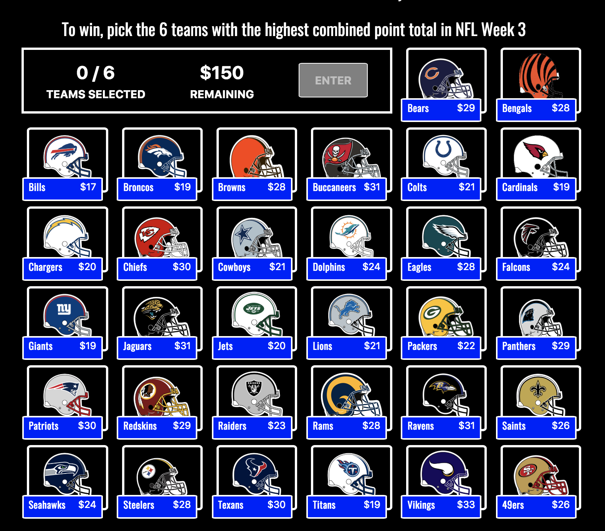

# Blockgame (smart contract code)
The smart contract code for my dApp [Blockgame](www.blockgame.cash).

It's a simplified version of fantasy football where you make a selection of six teams every week. 

Each player is allotted an $150 budget to choose the teams they believe will combine for the highest point total that week. 

Player with the highest combined total wins. 

Written in Solidity and connected to a React front end.

